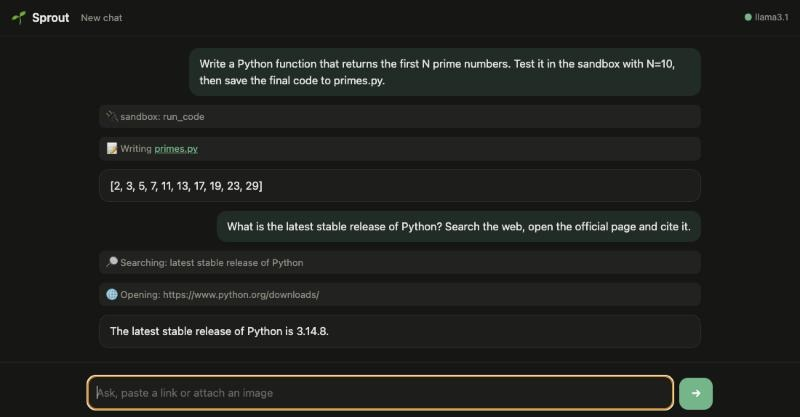

# Sprout 🌱

[](https://github.com/yartsun/sprout-agent/actions/workflows/ci.yml)


A small local AI agent you can read in one sitting. Point it at any OpenAI-compatible model (Ollama, llama.cpp,
LM Studio, vLLM or a hosted API) and it can search the web, read pages, look at images, keep files in a
workspace folder, use MCP servers and run code in a locked-down Docker sandbox.



<sub>A real run with llama3.1 8B in Ollama on a laptop.</sub>

## What it does

- **Any OpenAI-compatible model.** About 750 lines of Python and a single HTML page with no build step.
- **Built-in tools.** `web_search` (DuckDuckGo, no API key), `open_url` (main text and image links),
  `view_image` (for vision models) and `list_files` / `read_file` / `write_file` inside the workspace.
- **MCP client.** Reads `mcp.json` in the Claude Desktop / Cursor format and connects stdio, Streamable HTTP
  and SSE servers. Their tools reach the model as `server__tool`; a server that fails to start is reported
  and skipped.
- **Code sandbox.** An MCP server with `run_code` for Python, JavaScript and bash in a throwaway container:
  no network, 512 MB of memory, one CPU, no Linux capabilities, a read-only root and only the workspace mounted.
- **Streaming chat.** Every tool step appears as it happens. Images can be attached, and the page follows
  the system light or dark theme.

## Quick start

```bash
ollama pull llama3.1
git clone https://github.com/yartsun/sprout-agent && cd sprout-agent
python -m venv .venv && . .venv/bin/activate && pip install -e .
cp mcp.example.json mcp.json                # optional: MCP servers, including the sandbox
docker build -t sprout-sandbox sandbox      # optional: the image for the code sandbox
LLM_VISION=false sprout                     # open http://127.0.0.1:3300
```

`llama3.1` reads text only, hence `LLM_VISION=false`; with a vision model, leave it on.

## Models

| Server | `LLM_BASE_URL` |
|---|---|
| Ollama (default) | `http://127.0.0.1:11434/v1` |
| llama.cpp: `llama-server -m model.gguf --jinja` | `http://127.0.0.1:8080/v1` |
| LM Studio | `http://127.0.0.1:1234/v1` |
| A hosted OpenAI-compatible API | its URL, plus `LLM_API_KEY` |

The model has to support tool calling. Small local models (7–8B) use tools unevenly: they sometimes skip a
step or say they did something without calling the tool. In our runs llama3.1 8B handled multi-step tasks best
among the 7–12B models we tried. For dependable tool use, pick a 14B or larger model, or a hosted one.

## Configuration

| Variable | Default | Meaning |
|---|---|---|
| `LLM_BASE_URL` | `http://127.0.0.1:11434/v1` | OpenAI-compatible endpoint |
| `LLM_MODEL` | `llama3.1` | Model name |
| `LLM_API_KEY` | – | Sent as a bearer token |
| `LLM_TEMPERATURE` | `0.3` | Lower is steadier with tools |
| `LLM_EXTRA_BODY` | – | JSON merged into each request, e.g. `{"top_k": 20}` |
| `LLM_VISION` | `true` | `false` hides image tools and strips images for text-only models |
| `WORKSPACE` | `./workspace` | Folder for the file tools and the sandbox |
| `MCP_CONFIG` | `./mcp.json` | MCP servers |
| `MAX_STEPS` | `12` | Tool rounds before the agent must answer |
| `ALLOW_PRIVATE_URLS` | `false` | Let the agent open localhost and LAN addresses |
| `HOST`, `PORT` | `127.0.0.1`, `3300` | Where the UI listens |
| `ALLOWED_HOSTS` | – | Extra `host:port` values to accept, e.g. behind a reverse proxy |

## Security model

The agent can read the web, write files and run code, so the defaults are conservative:

- **Local only.** It listens on 127.0.0.1 and serves only requests whose `Host` is that address, which stops DNS
  rebinding. Cross-origin requests and non-JSON chat requests are refused, so another site open in your browser
  cannot drive the agent.
- **No private network.** `open_url` and `view_image` refuse loopback, private and link-local addresses, also
  after redirects, and stop downloads at 10 MB.
- **Isolated output.** Files the agent writes are served with `Content-Security-Policy: sandbox`, so HTML it
  generates cannot call the agent's API.
- **Contained files.** The file tools cannot leave the workspace: `..` and symlinks are resolved first.
- **No injected roles.** The chat endpoint accepts only user and assistant messages, so a client cannot inject
  system or tool messages.
- **Locked-down sandbox.** Code runs in the container described above.

Sprout has no accounts or authentication. Run it for yourself and do not expose it to a network.

## Adding tools

The easiest way is an MCP server: write one with the `mcp` SDK (see `sprout/sandbox_server.py`) and add it to
`mcp.json`. For a built-in tool, add its schema in `Toolbox.schemas()`, a method and a branch in `Toolbox.call()`
in `sprout/tools.py`.

## Development

```bash
pip install -e ".[dev]"
pytest                                       # tools, agent loop, HTTP layer, MCP client
docker build -t sprout-sandbox sandbox && SANDBOX_TESTS=1 pytest tests/test_sandbox.py
ruff check .
```

The tests run the agent loop against a fake OpenAI-compatible model and connect a real stdio MCP server; the
sandbox tests start real containers and check that the network is off, timeouts kill the process and the root
file system is read-only.

## License

[MIT](LICENSE)
